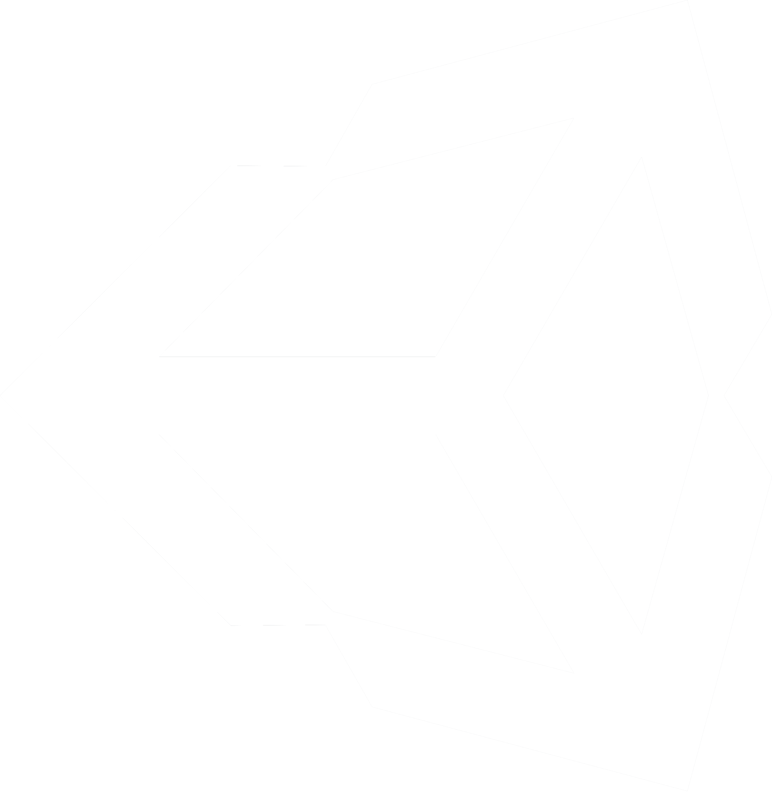
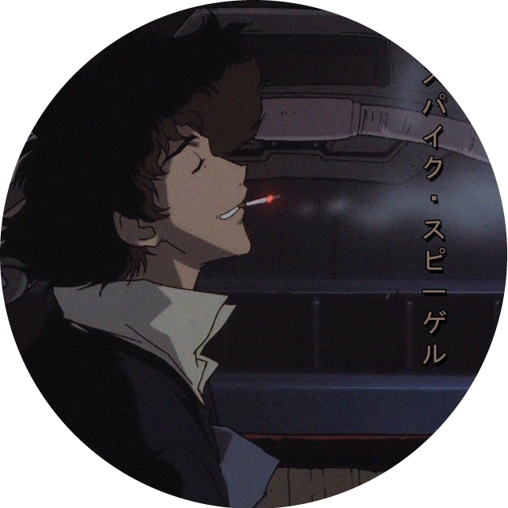

<h1>Olá, sou Luis Felipe</h1> 

<h3>Sobre Mim:</h3>

Sou um estudande de Ciência da Computação do 6 semestre, desde jovem sou apaixonado pelo mundo digital e venho buscando me desenvolver cada vez mais como Programador.

    <h2>Linguagens que uso</h2>
    
Clique nas imagens abaixo para ver os projetos respectivos de cada linguagem.

    <!-- Java -->
    
    <!-- C# -->
    
    <!-- Python -->
    
    <!-- HTML & CSS -->
    
    

    <h2>Futuro:</h2>
    
🔭 Atualmente, estou focado nas demandas da universidade e na busca por um estágio. Embora não tenha projetos pessoais em andamento, estou envolvido em projetos colaborativos com organizações, onde posso aplicar e expandir meus conhecimentos.

 

    <h2>Status</h2>
    <a href="https://github.com/Luis01Felipe">
        
        <!-- Talvez deixar comentado porque não tenho tantas tarefas feitas -->
        
    </a>

    <h2>Contatos:</h2>
    
    
    
    
    

